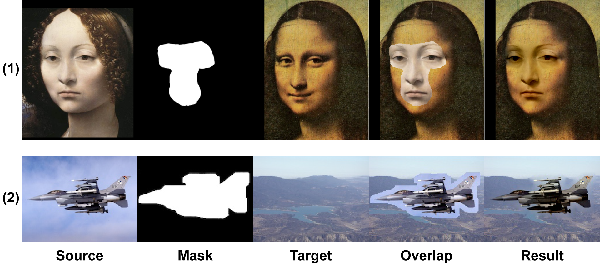
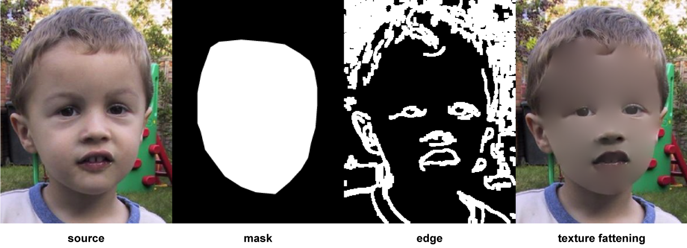

# poisson-image-editing
Implementation of ["Poisson Image Editing"](http://erikreinhard.com/papers/colourtransfer.pdf).  
  
Note: Local illumination changes, Local color changes, Seamless tiling is not implemented.  
  
ToDo
+ implement "Local illumination changes, Local color changes, Seamless tiling".
+ add offset information
+ want to create GUI

<p align="center">
  
  <div style="text-align: center;">
    Figure1. Seamless cloning(import, mixing gradients)
  </div>
</p>


<p align="center">
  
<div style="text-align: center;">
  Figure2. Selection editing(texuture flattening, local illumination changes, Local color changes)
</div>
</p>


## Environment
Ubuntu 18.04  
Python3.6(Anaconda3-5.2.0)


## Dependency

+ OpenCV3
+ numpy
+ sys
+ os


## Usage

```
python main.py argvs[1] argvs[2] argvs[3]

--> 
argvs[1]  :  path to source image   
argvs[2]  :  path to mask image
argvs[3]  :  path to target image
argvs[4]  :  method

```

## References

[1] [Pérez, Patrick](https://ptrckprz.github.io/), Michel Gangnet, and Andrew Blake. "Poisson image editing." ACM Transactions on graphics (TOG) 22.3 (2003): 313-318. [[Paper](http://www.irisa.fr/vista/Papers/2003_siggraph_perez.pdf "Paper")]

[2] [COMP 790-096: Computational Photography](https://www.cs.unc.edu/~lazebnik/research/fall08/jia_pan.pdf)

[3] [roadfromatoz's](https://github.com/roadfromatoz/poissonImageEditing) Implementation
